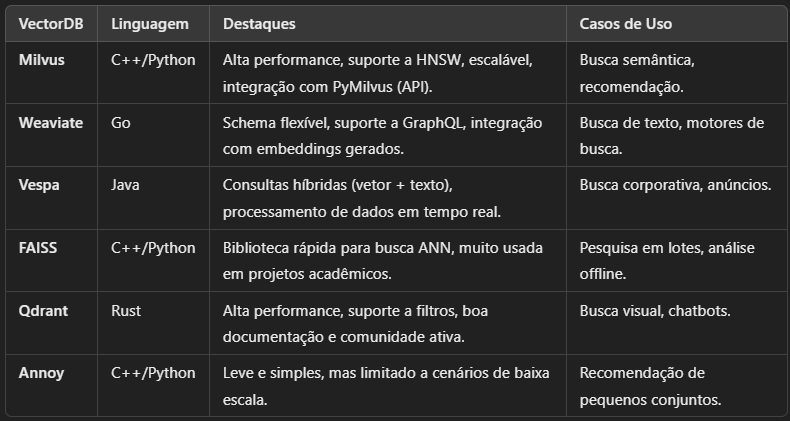
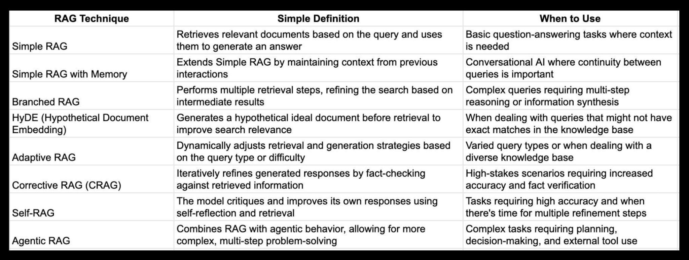

# avaliaca_mle_hotmart
Repositorio para desenvolvimento case mle hotmart

# Contexto

Na Hotmart, a principal capacidade que buscamos no prossional do futuro é a de **resolver desafios com protótipos que podem crescer e virar produtos incríveis.**

Seu desafioo será mostrar suas habilidades em aplicar tecnologias já existentes em uma tarefa que envolve **a criação de um protótipo de LLM com base em conhecimento.**

# Dois microsserviços:

1. O primeiro será responsável por **receber** um documento de texto extraído dessa página aqui, fazer seu processamento e o armazenar em um Vector Database;

2. O segundo será uma API que, **dado um texto de entrada no formato de pergunta**, busca nesse knowledge base qual(is) trecho(s) corresponde(m) a esse contexto, e usa isso como entrada para uma LLM gerar uma resposta.

# duvidas iniciais

## Extração de texto de uma pagina WEB

* Preciso me preocupar com o código que irá extrair o texto da pagina mencionada?

## Primeiro microsserviço

* Temos duas possibilidades para o primeiro microserviço, ele pode:
    * ser uma API que recebe um documento
    * ficar listening em uma pasta e processar qlqr documento que caia nessa pasta

R: Esperamos que as **duas APIs** e o VectorDB funcionem localmente via Docker compose;

# Escolha de tecnologias e frameworks

Entendendo a escolhas para esse projeto

## Backend API Framework

[FastAPI Best Practices](https://github.com/zhanymkanov/fastapi-best-practices)

FastAPI: fastAPI tem se mostrado como um dos melhores frameworks para backend python

Rapidez: compara-se com apis escritas em node e go

Suporte para operações assincronas: Modelos LLM, principalmente quando executados localmente, podem ter requisições demoradas e o suporte async é fundamental para nao haver bloqueio no servidor. Permitindo assim lidar com muitiplas requisições recorrentes de forma eficiente

Baseada em starlette e pydantic: altamente performatica para ASGI (Asynchronous Server Gateway Interface) e o Pydantic permite validação e parsing rapido de dados util ao lidar com dados estruturados.

## Vector DB

Dados são representados como vetores em um espaço dimensional.

Esses dados estão relacionados entre si. Embeddings de texto e imagem.

Estou bastante inclinado a escolher a lib em Rust, pois estou aprendendo aos poucos Rust. Então colocar essa DB na stack ira me incentivar ainda mais o uso e aprendizado em Rust.

Também estou praticando um pouco de Go, porém acho que Rust tem um diferencial em performance maior e tenho escutado um pessoal falar mal de GraphQL

possui suporte para python via lib [qdrant-client Docs](https://python-client.qdrant.tech/)

Opções:

## Modelo LLM para rodar local

Meu Hardware: RTX Nvidia 3060 12GB 

Devido ao modelo Llama ser, open-source e ter uma grande comunidade ao seu redor, esse modelo foi escolhido LLaMA-2 7B, pois ele é compativel com meu hardware.

Podemos também montar um plano de contigencia nesse caso, e caso o meu modelo de timeout, posso enviar a requisição para a API da OpenAI cobrir.

[Sparse Llama: Smaller Models for Efficient GPU Inference](https://neuralmagic.com/blog/24-sparse-llama-smaller-models-for-efficient-gpu-inference/)

[How far can we push LLM optimizations?](https://www.linkedin.com/posts/philipp-schmid-a6a2bb196_how-far-can-we-push-llm-optimizations-turns-activity-7267088429379731456-f8mV?utm_source=share&utm_medium=member_desktop)

[Qual modelo utilizar com uma RTX 3060 12gb](https://www.reddit.com/r/LocalLLaMA/comments/17mt9eo/lm_studio_which_model_to_use_with_rtx_3060/?tl=pt-br)

Para podemos rodar talvez na CPU também vamos adotar um modelo 3B

## Modelo para gerar embedding de texto

Sentence-BERT (all-MiniLM-L12-v2)

all-MiniLM-L6-v2

DistilBERT

MiniLM

T5 (Text-to-Text Transfer Transformer)

Escolhido:

all-MiniLM-L6-v2:
Vantagens: Leve, rápido, ideal para gerar embeddings de texto com boa qualidade para recuperação semântica e Q&A. hardware (RTX 3060 12GB).

## Indexação e Consulta

Llama_index ou fazer direto

# Stack Principal Definida

[Medium: Guia definitivo para vector database](https://datawaybr.medium.com/guia-definitivo-para-vector-databases-bbeeb8f0d802)

### APIs Backend:
* FastAPI (Python)
* Docker Compose para orquestração local

### Vector Database:
* Qdrant (implementado em Rust)
* Integração via qdrant-client (Python)

### Modelos de IA:
* LLM: LLaMA-2 3B (versão menor para melhor performance na RTX 3060 12GB)
* Backup: OpenAI API (plano de contingência)
* Embeddings: all-MiniLM-L6-v2 (modelo leve e eficiente para embeddings de texto)

[O jeito mais facil de rodar o llama no meu PC](https://www.reddit.com/r/LocalLLaMA/comments/1cktkhu/the_easier_way_to_run_a_local_llm/)

# Ollama

Here are some example models that can be downloaded:

| Model              | Parameters | Size  | Download                         |
| ------------------ | ---------- | ----- | -------------------------------- |
| Llama 3.2          | 3B         | 2.0GB | `ollama run llama3.2`            |
| Llama 3.2          | 1B         | 1.3GB | `ollama run llama3.2:1b`         |
| Llama 3.2 Vision   | 11B        | 7.9GB | `ollama run llama3.2-vision`     |
| Llama 3.2 Vision   | 90B        | 55GB  | `ollama run llama3.2-vision:90b` |
| Llama 3.1          | 8B         | 4.7GB | `ollama run llama3.1`            |
| Llama 3.1          | 70B        | 40GB  | `ollama run llama3.1:70b`        |
| Llama 3.1          | 405B       | 231GB | `ollama run llama3.1:405b`       |
| Phi 3 Mini         | 3.8B       | 2.3GB | `ollama run phi3`                |
| Phi 3 Medium       | 14B        | 7.9GB | `ollama run phi3:medium`         |
| Gemma 2            | 2B         | 1.6GB | `ollama run gemma2:2b`           |
| Gemma 2            | 9B         | 5.5GB | `ollama run gemma2`              |
| Gemma 2            | 27B        | 16GB  | `ollama run gemma2:27b`          |
| Mistral            | 7B         | 4.1GB | `ollama run mistral`             |
| Moondream 2        | 1.4B       | 829MB | `ollama run moondream`           |
| Neural Chat        | 7B         | 4.1GB | `ollama run neural-chat`         |
| Starling           | 7B         | 4.1GB | `ollama run starling-lm`         |
| Code Llama         | 7B         | 3.8GB | `ollama run codellama`           |
| Llama 2 Uncensored | 7B         | 3.8GB | `ollama run llama2-uncensored`   |
| LLaVA              | 7B         | 4.5GB | `ollama run llava`               |
| Solar              | 10.7B      | 6.1GB | `ollama run solar`               |
[Fonte](https://raw.githubusercontent.com/ollama/ollama/refs/heads/main/README.md)

# Rascunhos

